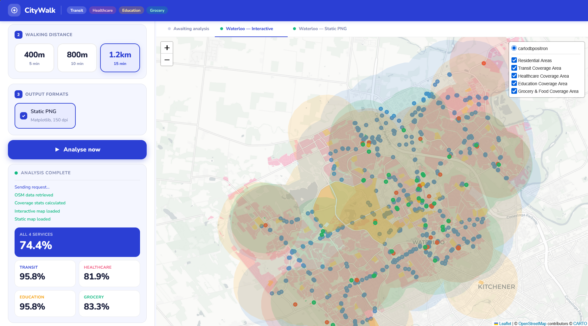

# Service Access Analysis

A geospatial walkability tool that maps how well residential areas are served by transit, healthcare, education, and 
grocery facilities within a configurable walking distance. Built with OpenStreetMap data, it produces both a static map 
and an interactive layer-based map for any city or region.

---

## Overview

Given a region name and a walking radius (5, 10, or 15 minutes), the tool:

- Fetches road networks, residential areas, and points of interest from OpenStreetMap
- Computes service coverage buffers for transit stops, healthcare facilities, schools, and grocery stores
- Calculates the percentage of residential area within walking distance of each service type
- Generates a static Matplotlib map (PNG) and an interactive Folium map (HTML) with toggleable layers

The web interface provides a split-pane layout with a configuration panel on the left and a live map viewer on the right.



---

## Setup

**Requirements:** Python 3.9+

Install dependencies:

```bash
pip install osmnx geopandas matplotlib folium flask flask-cors
```

---

## How to use

1. Start the backend server from your project directory:

```bash
python server.py
```

2. Open `ui.html` in your browser.

3. Enter a region name in the format `City, Province/State, Country`.

4. Select a walking time (5 / 10 / 15 minutes).

5. Optionally check **Static PNG** to also generate a downloadable map image.

6. Click **Analyse now**. The interactive map will load in the right panel once processing is complete (typically 30–90 seconds depending on city size).

---

## Known limitations

- **Analysis time** scales with city size. Large cities like Toronto may take several minutes due to the volume of OSM data being fetched.
- **OSM data quality** varies by region. Smaller or less-mapped cities may return incomplete results for some service categories.
- **Single-user only** because the Flask server is a development server and is not suitable for deployment or concurrent users.
- The server must be running locally for the UI to function; the HTML file cannot be used standalone.